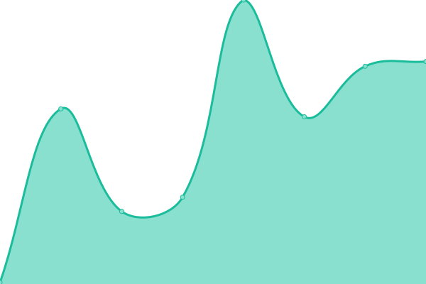
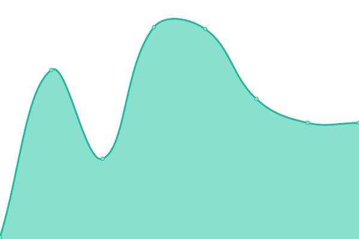
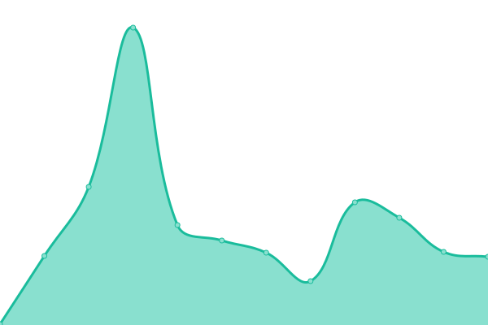
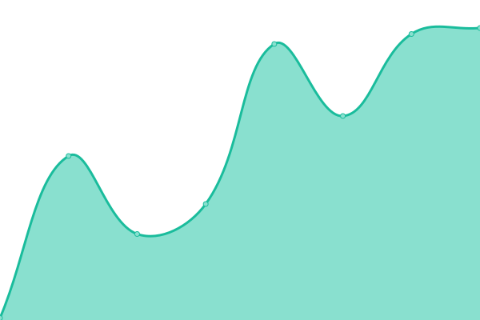
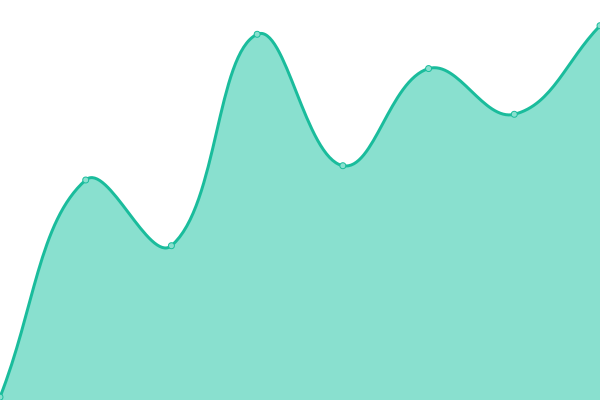

# [📈 Live Status](https://kevlugli.github.io/upptime-rewell): <!--live status--> **🟩 All systems operational**

This repository contains the open-source uptime monitor and status page for [Kev Lugli](https://kevlugli.github.io/upptime-rewell), powered by [Upptime](https://github.com/upptime/upptime).

With [Upptime](https://upptime.js.org), you can get your own unlimited and free uptime monitor and status page, powered entirely by a GitHub repository. We use [Issues](https://github.com/kevlugli/upptime-rewell/issues) as incident reports, [Actions](https://github.com/kevlugli/upptime-rewell/actions) as uptime monitors, and [Pages](https://kevlugli.github.io/upptime-rewell) for the status page.

<!--start: status pages-->
<!-- This summary is generated by Upptime (https://github.com/upptime/upptime) -->
<!-- Do not edit this manually, your changes will be overwritten -->
<!-- prettier-ignore -->
| URL | Status | History | Response Time | Uptime |
| --- | ------ | ------- | ------------- | ------ |
|  [Backend Prod](https://api2.getrewell.com) | 🟩 Up | [backend-prod.yml](https://github.com/kevlugli/upptime-rewell/commits/HEAD/history/backend-prod.yml) | 

 317ms
     
 | 

<a href="https://kevlugli.github.io/upptime-rewell/history/backend-prod">97.83%</a>
    

|  [Frontend Prod](https://app.getrewell.com) | 🟩 Up | [frontend-prod.yml](https://github.com/kevlugli/upptime-rewell/commits/HEAD/history/frontend-prod.yml) | 

 180ms
     
 | 

<a href="https://kevlugli.github.io/upptime-rewell/history/frontend-prod">100.00%</a>
    

|  [Backend Staging](https://sapi2.getrewell.com) | 🟩 Up | [backend-staging.yml](https://github.com/kevlugli/upptime-rewell/commits/HEAD/history/backend-staging.yml) | 

 182ms
     
 | 

<a href="https://kevlugli.github.io/upptime-rewell/history/backend-staging">98.80%</a>
    

|  [Frontend Staging](https://sapp.getrewell.com) | 🟩 Up | [frontend-staging.yml](https://github.com/kevlugli/upptime-rewell/commits/HEAD/history/frontend-staging.yml) | 

 166ms
     
 | 

<a href="https://kevlugli.github.io/upptime-rewell/history/frontend-staging">100.00%</a>
    

|  [Backend Test](https://tapi2.getrewell.com) | 🟩 Up | [backend-test.yml](https://github.com/kevlugli/upptime-rewell/commits/HEAD/history/backend-test.yml) | 

 178ms
     
 | 

<a href="https://kevlugli.github.io/upptime-rewell/history/backend-test">99.10%</a>
    

|  [Frontend Test](https://tapp.getrewell.com) | 🟩 Up | [frontend-test.yml](https://github.com/kevlugli/upptime-rewell/commits/HEAD/history/frontend-test.yml) | 

 173ms
     
 | 

<a href="https://kevlugli.github.io/upptime-rewell/history/frontend-test">100.00%</a>
    

<!--end: status pages-->

[**Visit our status website →**](https://kevlugli.github.io/upptime-rewell)

## 📄 License

- Powered by: [Upptime](https://github.com/upptime/upptime)
- Code: [MIT](./LICENSE) © [Kev Lugli](https://kevlugli.github.io/upptime-rewell)
- Data in the `./history` directory: [Open Database License](https://opendatacommons.org/licenses/odbl/1-0/)
